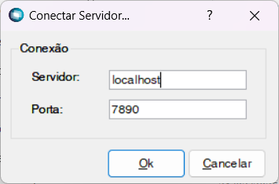
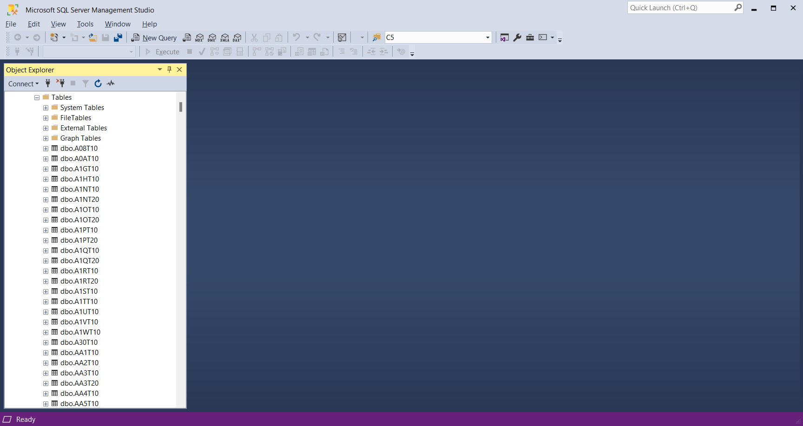

# Generator Protheus Container

[![NPM version][npm-image]][npm-url]

Container Protheus Generator for Yeoman.

> - **NÃO COMPARTILHE OS ARQUIVOS** `container.bat` e `yo-rc.json`
>   Estes arquivos podem conter senhas e chaves de acesso.
> - **NÃO COMPARTILHE A PASTA** `_images`
>   Esta pasta contem arquivos necessários para a construção dos containers e pode conter senhas e chaves de acesso.

> Adicione no `.gitignore'
```console
/_images
.yo-rc.json
container.[bat|sh]
```

## Requisitos

* [Node.js](https://nodejs.org/)
* [Docker](https://www.docker.com/) or [Podman](https://podman.io/)

## Instalação

Assumindo que já tenha o **NodeJS** e **Docker** (ou **Podman**) instalados:

```console
npm install -G yo generator-protheus-container
```

> Apoio:
> [Docker](https://www.docker.com/)
> [Podman](https://podman.io/)
> [Yeoman/Yo](http://yeoman.io/)
> [Generator Protheus Container](https://www.npmjs.com/package/generator-protheus-container)

## Uso

Para gerar um novo projeto container:

```console
mkdir my-protheus-container
cd my-protheus-container
yo protheus-container
```

Responda as perguntas e iniciar a criação do container:

```console
container.bat build
```

Após a criação do container, pode executá-lo com:

```console
container.bat start
```

### dbMonitor

Com o container inicializado, inicie a execução do dbMonitor no ambiente hospedeiro.



Use a porta informada na definição do container. Caso não consiga conexão, verifique a porta pública:

```console
podman ?????
```
### SSMS

Com o container inicializado, inicie a execução do SSMS no ambiente hospedeiro.


Use a porta e senha, informado na definição do container. Caso não consiga conexão, verifique a porta pública:

```console
podman ?????
```

> O atributo ``Server Name`` tem o formato: `address server` **`,`** `port number`.


## Para colaboradores

Faça uma bifurcação (_fork_) do repositório, faça sua implementação. Ao finalizar, faça um _pull request_ com suas alterações e aguarde a incorporação ao projeto original.

Para rodar a versão local do gerador, execute:

```console
cd <caminho/local/do/gerador/>
npm link
yo protheus-container
```

[npm-image]: https://badge.fury.io/js/generator-protheus-container.svg
[npm-url]: https://npmjs.org/package/generator-protheus-container
